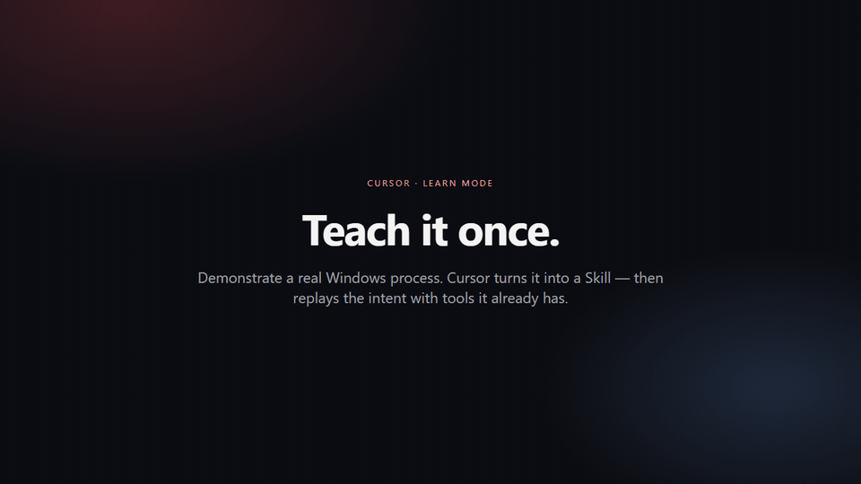

# Cursor Learn Mode

[](https://github.com/liad07/cursor-learn-mode/actions/workflows/ci.yml)
[](LICENSE)

<p align="center">
  
</p>
<p align="center">
  <em>Teach it once. Replay the intent — not a mouse-coordinate macro.</em>
</p>

Teach Cursor a **Windows or macOS** (or browser) process by demonstrating it. Learn Mode records the **meaning** of the steps and saves a standard Cursor Skill. The next time you ask, the Cursor Agent runs that Skill with tools you already have — desktop computer-use, Playwright MCP, and the terminal.

**Learn Mode does not execute workflows.** It records, sanitizes, and writes a Skill.

---

## How it works

1. In Cursor, say `/learn` or “teach Cursor what I’m doing now”.
2. Click **Start Learning**. An on-screen HUD shows time and event count.
3. Perform the process (desktop apps, browser, Explorer/Finder, terminal — including switching between them).
4. Click **Stop** on the overlay, or press `Ctrl+Shift+L` (Windows) / `Cmd+Shift+L` (macOS).
5. Review the preview (name, apps, inputs, steps) and **Save Skill**.

Later, in a new chat, ask Cursor to do the same job with different inputs. The agent reads the Skill and chooses existing tools.

Passwords, tokens, cookies, and `Authorization` headers are redacted. They are not written into the Skill.

---

## Example

The GIF above is a Notepad flow: type content → Save As → filename. On a Mac, the same idea is TextEdit + Save / Export.

Learn Mode turns that into a Skill with inputs such as `content` and `filename`, not a list of screen coordinates. Replay is a new request with new values.

---

## Requirements

- **Windows 10/11** or **macOS**
- [Node.js 20+](https://nodejs.org/)
- [Cursor](https://cursor.com/)
- Windows: [.NET 8 SDK](https://dotnet.microsoft.com/download/dotnet/8.0) (builds the observer)
- macOS: Xcode Command Line Tools (`swiftc`) and **Accessibility** permission for Cursor (System Settings → Privacy & Security → Accessibility)

For replay, the Cursor Agent uses MCPs already configured in Cursor. This repo does not replace those engines.

---

## Install

```bash
git clone https://github.com/liad07/cursor-learn-mode.git
cd cursor-learn-mode
npm install
npm run build-observer
```

Add a `learn-mode` server to `~/.cursor/mcp.json` (Windows: `%USERPROFILE%\.cursor\mcp.json`). See [`mcp.json.example`](mcp.json.example).

**Windows**

```json
{
  "mcpServers": {
    "learn-mode": {
      "command": "npx",
      "args": ["--yes", "tsx", "C:\\Users\\<you>\\cursor-learn-mode\\src\\mcp\\server.ts"]
    }
  }
}
```

**macOS**

```json
{
  "mcpServers": {
    "learn-mode": {
      "command": "npx",
      "args": ["--yes", "tsx", "/Users/<you>/cursor-learn-mode/src/mcp/server.ts"]
    }
  }
}
```

Use the real clone path. Reload MCP in Cursor and confirm `learn-mode` is connected.

Then in chat: `/learn` → Start → demonstrate → Stop → Save Skill.

On macOS, grant Accessibility the first time recording starts. If the observer fails to start, enable Cursor (and Terminal if you launch the observer from there) under Accessibility and try again.

---

## Usage

| You | Cursor |
|-----|--------|
| `/learn` | Opens Learn Mode in chat |
| **Start Learning** | Starts recording; HUD appears |
| Demonstrate the process | Observer records apps, UI targets, typing, and screenshots |
| **Stop** or `Ctrl+Shift+L` / `Cmd+Shift+L` | Saves a sanitized session and shows a preview |
| **Save Skill** | Writes `~/.cursor/skills/<name>/SKILL.md` and `workflow.json` |
| “Do that again with these inputs” | Agent follows the Skill with existing tools |

Recordings stay in `.learn-recordings/` (gitignored). They are not the Skill.

MCP tools: `learn_open`, `learn_start`, `learn_status`, `learn_pause`, `learn_stop`, `learn_save`, `learn_list`, `learn_discard`.

---

## Security

- Password fields are stored as `[REDACTED]`
- Clipboard that looks like a secret (tokens, keys, Bearer headers) is not kept as plaintext
- Generated skills tell the agent to use your current logged-in session — never embedded credentials
- Do not commit `.learn-recordings/` or a machine-specific `mcp.json`

If you typed a secret during a demo, discard the session and record again without it.

---

## License

MIT © [liad07](https://github.com/liad07)
