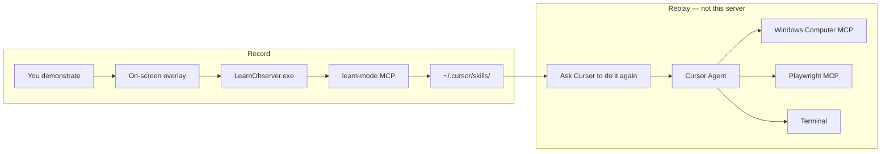

# Cursor Learn Mode

<p align="center">
  
</p>
<p align="center">
  <em>Teach it once. Replay the intent — not a mouse-coordinate macro.</em>
</p>

**Teach Cursor any Windows desktop or browser workflow by demonstrating it once.**  
The next time you ask, the agent replays the *intent* using [Playwright MCP](https://github.com/microsoft/playwright-mcp) for the web and **Windows Computer MCP** for native apps.

[](LICENSE)
[](https://nodejs.org)
[](https://dotnet.microsoft.com)
[](https://modelcontextprotocol.io)
[](https://www.microsoft.com/windows)

---

## Why this exists

Most “record and replay” tools save clicks as `(x, y)` and break the moment a window moves. Learn Mode does the opposite:

1. **You demonstrate** a real process (Explorer, Notepad, Chrome, Settings, a SaaS admin, a terminal).
2. **Learn Mode records semantics** — application, control name, typed intent — and writes a standard Cursor Skill (`SKILL.md` + `workflow.json`).
3. **Cursor Agent replays** with the tools it already has:
   - **Windows Computer MCP** — UI Automation first, screenshot/vision second, coordinates only as a last resort.
   - **Playwright MCP** — pages, locators, forms, and browser flows.
   - **Terminal** — CLI steps from the demonstration.

Passwords, tokens, cookies, and `Authorization` headers are stripped. They never land in the Skill or in git.

---

## Demo: weekend packing list

A random real process we recorded while building this: **open Notepad → type a packing list → Save As**.

| You do | Learn Mode sees |
|--------|-----------------|
| `/learn` or *תלמד מה שאני עושה עכשיו* | MCP App card in Cursor chat |
| Click **Start Learning** | On-screen HUD: time, event count, Pause / Stop |
| Type the list in Notepad | Semantic step: *Type the document content* (`content` input) |
| **Save As** `packing-list.txt` | *Enter the destination file name* (`filename` input) |
| Overlay **Stop** or `Ctrl+Shift+L` | Preview → **Save Skill** |

Next chat, different inputs:

> תיצור ככה קובץ בשם `beach-kit.txt` עם רשימת ציוד לים

Cursor reads the Skill and drives **Windows Computer MCP**. Same workflow, new file.

<p align="center">
  
  &nbsp;
  
</p>
<p align="center">
  <sub>Left: the file from the live demo. Right: the real HUD captured during a Learn session (Pause / Stop / Ctrl+Shift+L).</sub>
</p>

The GIF at the top walks the full loop: trigger → overlay → type → Save As → semantic preview → replay in a new chat.

---

## How it works



Learn Mode **does not execute** the workflow. It only records and generates the Skill. Replay is always the Cursor Agent plus the companion MCPs below.

---

## Features

- **One-shot teaching** — say `/learn` or “teach Cursor what I’m doing now”
- **Live HUD** — Pause / Stop on a click-through overlay (`Ctrl+Shift+L` also stops)
- **Semantic skills** — intent steps, inputs, preconditions, success checks
- **Secret sanitization** — redacts clipboard/password fields and common token prefixes
- **MCP App UI** — Start / Pause / Stop / Save from the Cursor chat card
- **Replay-ready** — generated skills tell the agent to use Playwright MCP and Windows Computer MCP, never coordinate macros

---

## Requirements

| Tool | Why |
|------|-----|
| Windows 10/11 | Desktop observer (WinForms + UI Automation) |
| [Node.js 20+](https://nodejs.org/) | Learn Mode MCP (`tsx`) |
| [.NET 8 SDK](https://dotnet.microsoft.com/download/dotnet/8.0) | Builds `LearnObserver.exe` |
| [Cursor](https://cursor.com/) | Host for MCP servers and Skills |
| [Playwright MCP](https://github.com/microsoft/playwright-mcp) | Browser replay |
| Windows Computer MCP | Native Windows UI replay |
| [Microsoft WinApp CLI](https://learn.microsoft.com/windows/winapp/) | UI Automation backend for Windows Computer MCP |
| Python 3.12 | Windows Computer MCP runtime |

---

## Quick start

```powershell
git clone https://github.com/liad07/cursor-learn-mode.git
cd cursor-learn-mode
npm install
npm run build-observer
npm test
```

Point Cursor at the MCP (see [Install in Cursor](#install-in-cursor)), reload MCP, then in chat:

1. **“Teach Cursor what I’m doing now”** (or `/learn`)
2. Click **Start Learning**
3. Demonstrate the process
4. **Stop** on the overlay (or `Ctrl+Shift+L`)
5. Review the preview → **Save Skill**

Next session: *“Do the workflow I taught you, with these inputs.”*  
The agent reads `~/.cursor/skills/<name>/` and drives **Playwright MCP** / **Windows Computer MCP** / the terminal.

---

## Install in Cursor

User MCP file: `%USERPROFILE%\.cursor\mcp.json`

A complete example lives in [`mcp.json.example`](mcp.json.example). Merge the three servers below (replace `<you>` and clone paths).

### 1. Learn Mode (this repo)

```json
"learn-mode": {
  "command": "npx",
  "args": [
    "--yes",
    "tsx",
    "C:\\Users\\<you>\\path\\to\\cursor-learn-mode\\src\\mcp\\server.ts"
  ]
}
```

If `npx tsx` is slow on first launch, install deps in the repo (`npm install`) and call the local binary:

```json
"learn-mode": {
  "command": "C:\\Users\\<you>\\path\\to\\cursor-learn-mode\\node_modules\\.bin\\tsx.cmd",
  "args": [
    "C:\\Users\\<you>\\path\\to\\cursor-learn-mode\\src\\mcp\\server.ts"
  ]
}
```

`learn_start` builds the observer automatically if `observer/dist/LearnObserver.exe` is missing. Running `npm run build-observer` yourself is still the reliable path.

Restart MCP: Command Palette → **MCP: Restart** (or reload the window). Confirm the `learn-mode` server is connected.

### 2. Playwright MCP (browser replay)

Official server: [`@playwright/mcp`](https://github.com/microsoft/playwright-mcp)

```json
"playwright": {
  "command": "npx",
  "args": ["-y", "@playwright/mcp@latest", "--extension"]
}
```

`--extension` attaches through the Playwright browser extension so the agent can drive the same Chrome/Edge profile you already use. Omit it if you want an isolated Playwright browser.

First-time Playwright browsers (if the server asks):

```powershell
npx playwright install
```

**When replay uses it:** any learned step that happened in a web page — search, fill a form, click a locator, wait for navigation. Prefer roles, labels, and placeholders over pixel clicks.

### 3. Windows Computer MCP (desktop replay)

Companion MCP for native Windows apps. It talks to **UI Automation** first (`find_element`, `invoke_control`, `set_text`, …). Screenshots and `click_at` are fallbacks only, and coordinate tools require a fresh `screenshot_id`.

Install WinApp CLI:

```powershell
winget install Microsoft.WinAppCli
```

Create the Python environment (adjust the clone path to wherever you keep the Windows Computer MCP package):

```powershell
cd $env:USERPROFILE\cursor-tools\windows-computer-mcp
py -3.12 -m venv .venv
.\.venv\Scripts\python -m pip install -e ".[dev]"
```

Cursor config:

```json
"windows-computer": {
  "command": "C:\\Users\\<you>\\cursor-tools\\windows-computer-mcp\\.venv\\Scripts\\python.exe",
  "args": ["-m", "windows_computer_mcp"],
  "env": {
    "WINAPP_CLI_TELEMETRY_OPTOUT": "1"
  }
}
```

If `winapp` is missing from PATH after install, restart Cursor so it inherits the updated user PATH, or set `WINAPP_PATH`.

**When replay uses it:** Notepad, Explorer, Settings, desktop installers, Win32/WPF/WinUI apps. Preferred order:

1. Structured UI Automation (`find_element` → `invoke_control` / `set_text`)
2. `take_screenshot` + vision
3. `click_at` / `type_text` **only** with a screenshot from the last 30 seconds

Do **not** start with coordinates. Browser work stays on Playwright MCP — Windows Computer MCP does not wrap Playwright.

---

## Usage

| You say | Agent does |
|---------|------------|
| `/learn`, “record a skill”, “teach Cursor what I’m doing now” | `learn_open` → `learn_start` |
| Demonstrate on the desktop | Observer records clicks, keys, app changes, screenshots |
| Overlay **Stop** or `Ctrl+Shift+L` | `learn_stop` → semantic preview |
| Confirm the preview | `learn_save` → `~/.cursor/skills/<name>/SKILL.md` |
| “Do that again with customer X” | Agent follows the Skill with Playwright / Windows Computer / terminal |

### Overlay

- **Pause / Resume** — skip noise while you switch windows
- **Stop** — end the session from the HUD
- Clicks on the HUD chrome pass through to the app underneath; only the buttons capture input

### Generated Skill layout

```text
%USERPROFILE%\.cursor\skills\<workflow-name>\
  SKILL.md          # agent instructions (intent, inputs, safety)
  workflow.json     # structured steps + applications
```

Recordings stay in `.learn-recordings/` (gitignored). They are not the Skill.

---

## Architecture

| Piece | Path | Role |
|-------|------|------|
| MCP server | `src/mcp/server.ts` | stdio MCP: `learn_open`, `learn_start`, `learn_pause`, `learn_stop`, `learn_save`, `learn_discard` |
| Chat UI | `src/mcp/app.html` | MCP App card in Cursor chat |
| Controller | `src/learn/controller.ts` | session lifecycle |
| Observer | `observer/` | `LearnObserver.exe` — low-level hooks + HUD |
| Analysis | `src/analysis/` | compress events → workflow |
| Sanitize | `src/sanitize.ts` | strip secrets and debug coordinates |
| Skill writer | `src/generator/` | `SKILL.md` + `workflow.json` |

```text
Cursor chat
  → learn-mode MCP (stdio)
      → LearnObserver.exe
          → WH_MOUSE_LL / WH_KEYBOARD_LL (observe only)
          → UI Automation element names
          → screenshots (throttled, password fields skipped)
      → analyze + sanitize
      → ~/.cursor/skills/<name>
```

---

## Security

Learn Mode is a recorder, not a password manager.

- Password fields are redacted (`[REDACTED]`)
- Clipboard that looks like a token (`ghp_`, `sk-`, `Bearer `, `AKIA`, JWT `eyJ`, …) is not stored as plaintext
- Skills instruct the agent to use **your already-logged-in session**
- Never commit `.learn-recordings/`, `.env`, or real `mcp.json` with machine-specific secrets

If a demonstration includes credentials, stop, discard the session, and re-record without typing secrets.

---

## Development

```powershell
npm install
npm run build-observer   # dotnet publish → observer/dist
npm test
npm run typecheck
npm run mcp              # stdio server (Cursor usually launches this)
```

Observer source: `observer/OverlayForm.cs`, `Program.cs`, `Win32.cs` (`net8.0-windows`).

---

## FAQ

**Does this replace Playwright?**  
No. Playwright MCP is how **web** steps are replayed. Learn Mode only writes the Skill.

**Does this replace Windows Computer MCP?**  
No. That MCP is a black box at replay time. Learn Mode must not reimplement it.

**Why not replay recorded coordinates?**  
Windows DPI, window size, and layout change. Intent + UI Automation / locators survive that. Coordinates are a last-resort fallback inside Windows Computer MCP, gated on a fresh screenshot.

**Can I use this on macOS / Linux?**  
The observer is Windows-only. Playwright MCP still works for browser-only teaching if you skip the desktop HUD.

**Will a private GitHub repo get stars?**  
Stars count on **public** repos. This project is documented so you can flip visibility when you are ready: GitHub → Settings → Change repository visibility.

---

## License

[MIT](LICENSE) © 2026 [liad07](https://github.com/liad07)
